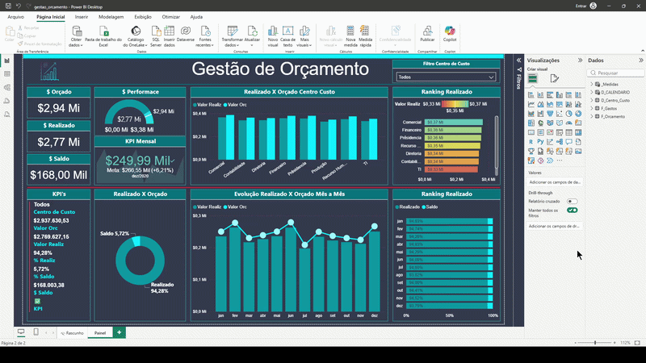
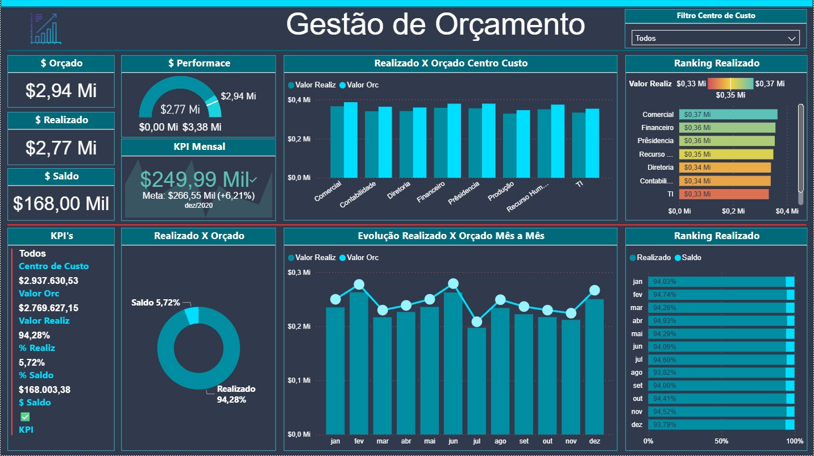
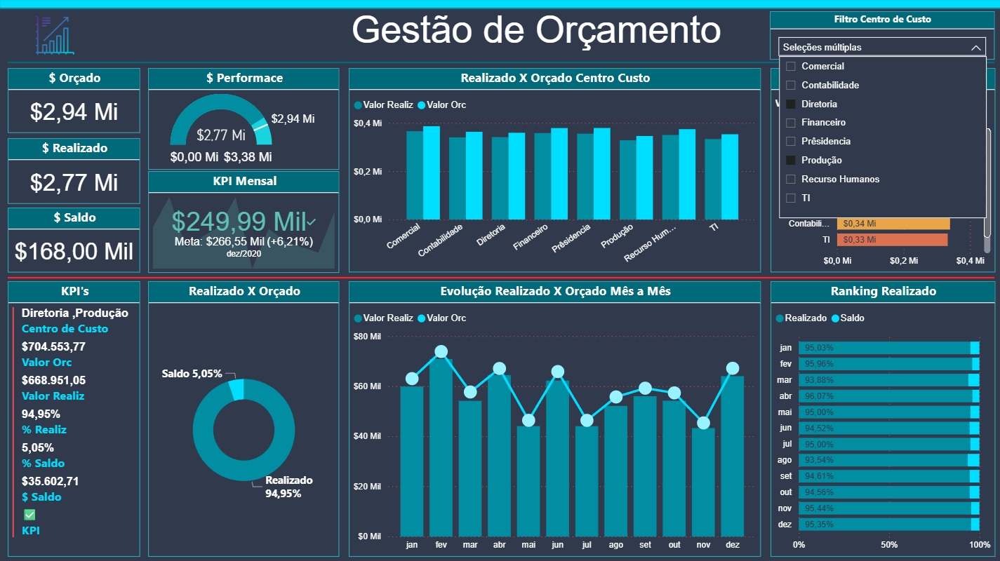

# Dashboard de Vendas - Power BI

Projeto desenvolvido para análise de vendas utilizando Power BI.

## Objetivos
- Monitorar orçamento realizado versus planejado
- Avaliar desempenho financeiro por centro de custo
- Identificar setores com maior consumo orçamentário
- Acompanhar evolução mensal de gastos
- Analisar saldo orçamentário disponível
- Facilitar tomada de decisão financeira através de indicadores visuais

## Tecnologias
- Power BI
- Power Query
- DAX
- Modelagem de Dados
- ETL de dados financeiros
- Excel / CSV

## Métricas
- Valor Orçado
- Valor Realizado
- Saldo Orçamentário
- Percentual Realizado
- Performance financeira
- Ranking por centro de custo
- Evolução mensal do orçamento
- KPI mensal de desempenho

## Funcionalidades
- Filtro dinâmico por centro de custo
- Comparativo realizado vs orçado
- Indicadores KPI financeiros
- Ranking de desempenho por setor
- Visualização temporal mensal
- Dashboard interativo

## Dashboard

---

---

